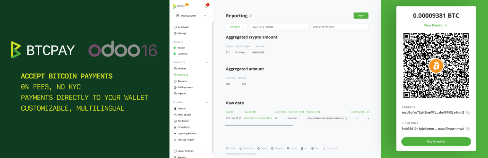

# BTCPay Server payment gateway for Odoo 16

## This is the module to connect Odoo 16 and BTCPay Server
This module allows you to accept bitcoin (and other cryptocurrency) payments in your Odoo e-commerce store.  

## Install the module
* Clone our [repository](https://github.com/btcpayserver/odoo) or download the .zip from the [releases page](https://github.com/btcpayserver/odoo/releases)
* Make sure you are on branch `16.0` or downloaded a release tagged with version v16.x
* Place the `payment_btcpayserver` directory in your Odoo addons directory
* Install dependencies by running `pip install -r requirements.txt` (from inside the `payment_btcpayserver` directory)
* Restart Odoo
* Go to Apps -> Update Apps List
* Remove the "Apps" filter and search for "btcpay"
* Click **Activate** button
  
## Configure BTCPay as payment provider
* Go to  **Website** -> **Configuration** -> **Payment Providers**
* Search for BTCPay and click on button **Activate**

In the BTCPay settings form, tab "Credentials":
* Set field "State" to enabled
* Set field "BTCPay Server URL" as test or live URL including https://. Example URL: https://testnet.demo.btcpayserver.org
* Get a pairing code from your BTCPay Server store: Settings -> Access Tokens
  * Click on "Create Token" button
  * Label: enter e.g. "My odoo store"
  * Public Key: leave empty
  * Click on "Request Pairing" button, on next page click "Approve" button
  * At the top copy the code next to "Server initiated pairing code", e.g. "hg7z8wN"
* Back in Odoo, paste the code into "Pairing Code" field
* Hit Tab key on your keyboard (or click on another field) and the pairing process will start automatically
* When the pairing is successful the "Token" and "Private Key" field will be filled automatically
* Field Facade, keep default 'merchant'.

On the tab "Configuration":
* Set field "Payment Journal" to "Bank", you can click the dropdown and click on the suggestion "Bank"
* Now you can **save** the settings

## How does the payment page look?

During the checkout the customers will have the option to select the payment method "Pay with Bitcoin / Lightning Network". After selecting they will be redirected to the BTCPay checkout page as shown below.

## Transaction BTCPay Details
In transaction object, you will find more technical information about this method of payment:
* Transaction Id: cryptocurrency transaction hash for the executed payout
* Invoice Id: the id of the invoice for which you want to fetch an event token
* Transaction Status: That indicates state of transaction

